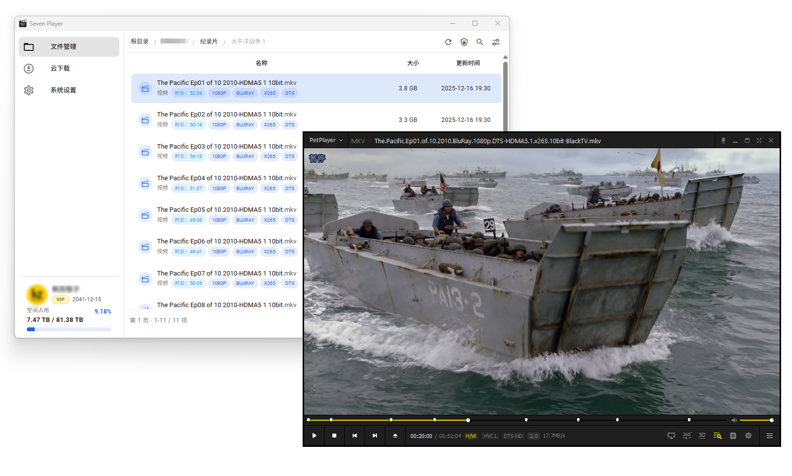

  

<h1 align="center">Seven Player</h1>

  面向 115 用户的 Windows 外部播放器体验增强工具

  <a href="https://www.dbkuaizi.com/archives/seven-player.html">作者博客</a>
  ·
  <a href="https://cnb.cool/dbkuaizi/seven-player">CNB</a>
  ·
  <a href="https://github.com/dbkuaizi/seven-player">GitHub</a>

## 项目简介

Seven Player 是一个使用 `Go + Wails v3 + Vue 3 + Vuetify` 构建的桌面应用，目标是让 115 网盘文件在 Windows 本地电脑上更方便地交给外部播放器播放。

基于当前技术栈，理论上可以适配 Linux 系统，包括 `x86` 与 `ARM` 架构；但由于暂时没有明确使用需求，当前不提供 Linux 预构建版本，有需要可以自行编译，也欢迎提交 Issue 交流。

它不提供资源、不分发内容、不内置网页播放器，也不替代 115 官方服务。应用只负责登录、浏览文件、生成本地播放代理，并调用你电脑上已经安装的播放器。

## 界面预览

  

## 下载与发布

Seven Player 的发布附件由 CNB 在线构建生成，CNB Release 是主发布渠道；同一批构建产物会同步上传到 GitHub Release，作为备用下载入口。

- CNB Release: https://cnb.cool/dbkuaizi/seven-player/-/releases
- GitHub Release: https://github.com/dbkuaizi/seven-player/releases
- GitHub 仓库不单独构建产物，只接收 CNB 在线构建后的附件。

## 功能特性

- 115 二维码登录、Cookie 登录与登录态恢复
- 文件目录浏览、搜索、类型筛选、排序与快捷目录访问
- 支持文件名简化、小文件隐藏与列表分页，浏览剧集目录更清爽
- 115 离线下载任务查看与管理
- 双击视频或点击立即播放，自动交给外部播放器
- 支持默认播放器切换、播放器路径设置、启用与禁用
- 支持外挂字幕绑定，下次播放自动带上字幕
- 支持起播跳转，可按秒数或时间点开始播放
- 支持续播记录，重新打开时可从上次位置继续
- 支持精简文件标题、界面缩放、主题模式与主题色设置
- 支持 115 隐私模式切换与隐私目录展示
- 本地数据统一保存到 `data.db`，不上传到任何第三方服务

## 播放器支持

以下为当前支持的外部播放器。推荐优先使用 MPV，续播、字幕和跳转能力最完整。

| 播放器 | 推荐度 | 起播跳转 | 外挂字幕 | 说明 |
| --- | --- | --- | --- | --- |
| MPV | 首选推荐 | 支持 | 支持 | 续播记录最完整 |
| PotPlayer | 推荐 | 支持 | 支持 | Windows 常用，兼容性好 |
| VLC | 推荐 | 支持 | 支持 | 跨平台稳定，基础播放可靠 |
| MPC-BE | 备用 | 暂不支持 | 支持 | 适合作为兼容播放器备用 |
| MPC-HC | 备用 | 暂不支持 | 支持 | 旧版兼容播放器 |

如果系统没有自动检测到播放器，可以在应用的系统设置里手动选择播放器可执行文件路径。

## 本地数据

Seven Player 的登录状态、播放器路径、界面偏好、续播记录和字幕绑定都会保存在本机，不会上传到任何第三方服务。

应用不会保存或缓存你的媒体文件，播放时只会把文件交给你本地安装的外部播放器处理。

## 技术栈与协议

- 技术栈：`Go`、`Wails v3`、`Vue 3`、`Vuetify`、`SQLite`
- 开源协议：[Apache License 2.0](./LICENSE)

## 开源地址

- CNB: https://cnb.cool/dbkuaizi/seven-player
- GitHub: https://github.com/dbkuaizi/seven-player
- 作者博客: https://www.dbkuaizi.com/archives/seven-player.html

## 版权与声明

Seven Player 以 Apache License 2.0 协议开源，免费提供给用户使用。项目本身不包含付费解锁、商业售卖或资源分发行为。

本项目用于改善 115 用户在 Windows 本地电脑上的文件浏览与外部播放器调用体验，不提供内容资源，不存储或分发第三方内容，也不代表 115 官方立场。使用者应自行确认账号、文件和播放行为符合相关服务条款及适用法律法规。

## 作者

两双筷子
